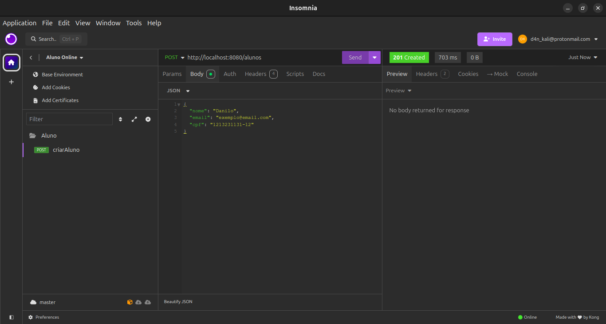
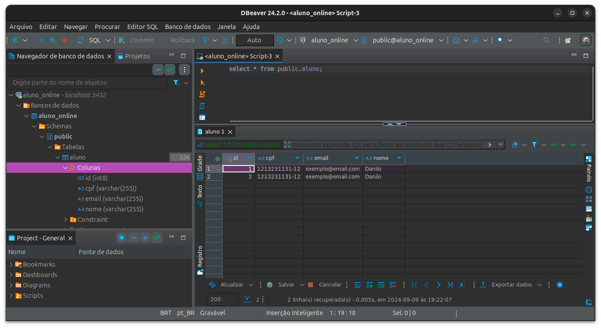

# Exercício 1

## API Aluno Online - criarAluno funcionando

Projeto de uma **API** *RESTful* feito no ecossistema *Spring Boot* com o objetivo de gerenciar o cadastro de alunos, armazenando informações como nome, email, CPF e geração de um código identificador único, usando o a arquitetura **MVC** (Model-View-Controller).

## Estrutura do Projeto

### 1. *Controller*

O *controller* lida com as **request** HTML para `aluno` e comunicar com o *service*.

#### Annotations em `AlunoController`:

- *@RestController*: Define a classe como um controlador *RESTful*.
- *@RequestMapping("/alunos")*: Define a rota `/alunos`.
- *@PostMapping*: Mapeia requisições HTTP POST para o método `criarAluno()`.
- *@RequestBody*: Converte o corpo da **request** para o objeto `Aluno`.
- *@ResponseStatus(HttpStatus.CREATED)*: Retorna o status 201 (Created) após a criação do objeto `aluno` ser feita com sucesso.

### 2. *Model* 

O *model* ajuda a construir os atributos de `aluno`.

#### Annotations em  `Aluno`:

- *@Entity*: Marca a classe como uma entidade **JPA** e representa como uma tabela no banco de dados.
- *@Id*: Define chave primária no banco.
- *@GeneratedValue(strategy = GenerationType.IDENTITY)*: Gera automaticamente o valor da chave primária `id`.
- *@NoArgsConstructor*: Gera um construtor sem parâmetros (*Lombok*).
- *@AllArgsConstructor*: Gera um construtor com todos os parâmetros (*Lombok*).
- *@Data*: Usa o *Lombok* para gerar métodos uteis.

### 3. *Repository*

O *repository* define a interface para interagir com o banco de dados.

#### Annotation em `AlunoRepository`:

- *@Repository*: Define a interface como um repositório de dados.

### 4. *Service*

O *service* contem as regras de negócios do repositório.

#### Annotations em `AlunoService`:

- *@Service*: Marca a classe como um serviço *Spring*.
- *@Autowired*: Permite a injeção do `AlunoRepository`.
- *criarAluno(Aluno aluno)*: Salva o aluno no banco de dados.

## Teste dos *Request* no **Insomnia**

```json
{
	"nome": "Danilo",
	"email": "exemplo@email.com",
	"cpf": "1213231131-12"
}
```



Retornou o status 201, indicando que o aluno foi criado e armazenado no banco de dados com sucesso.

## Consulta no Banco de Dados

### Informações sobre o Banco:

- Banco de Dados: **PostgreSQL**.
- Porta: 5432.
- Software Gerenciamento de Bancos: **Dbeaver**.
- Database: `aluno_online`.
- URL: [jdbc:postgresql://localhost:5432/aluno_online](jdbc:postgresql://localhost:5432/aluno_online).



Apos executar a consulta `select * from public.aluno`, foi exibido os alunos criados apos os *request*.
