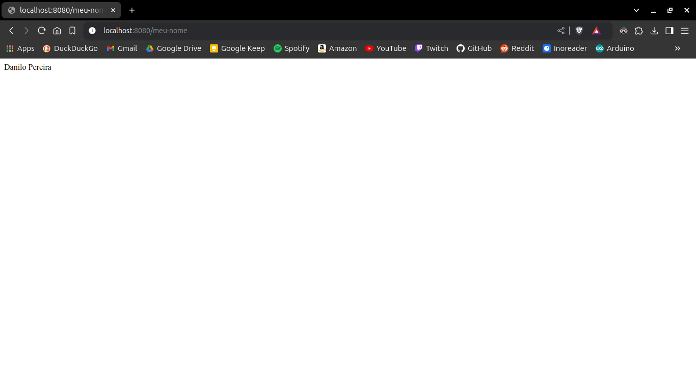

# Atividade 1 - Endpoint que Exibe seu Nome

- Replicar o exercício do endpoint que exibe o nome que foi feito em sala;
- Mandar o link do repositório no github;
- Colocar no README o print do resultado no navegador;
- Só aceito link de repo no github. nada mais.

## Imagem:

